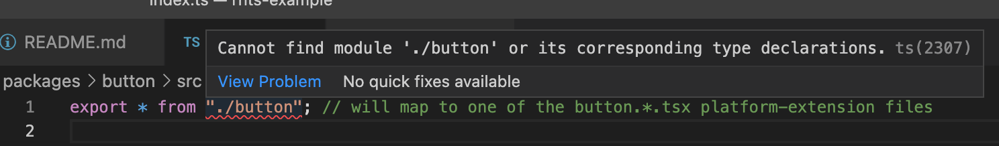

# React-Native TypeScript Example

This repo shows examples of of areas where react-native would benefit from a deeper integration with TypeScript. The problems areas are described below and expressed in code. The intent is to provide a playground for developing solutions to these problems.

The repo is currently "broken", meaning it can't build, bundle or provide full IntelliSense. Once the problems are fixed, everything should work.

Interesting commands (from the repo root):

```
yarn run build
yarn run bundle
```

There are two packages in this repo. `Button` is a react-native-only control, and it is specialized per-platform. `App` is a react-native application, which depends on `Button`.

## React-Native Platform Extensions

react-native tools use a specialized module resolver to enable [platform-specific extensions](https://reactnative.dev/docs/platform-specific-code#platform-specific-extensions). The tools all require a target platform, which they use when matching a module to a file. The resolver first looks for `<module>.<platform>.js`, then `<module>.native.js`, and finally `<module>.js`.

The intermediate name *native* is used as a fallback. If found, the implementation
should be suitable for any react-native platform. This is useful for projects
that are a mix of react-native and web code. Web code lives in files without a platform
extension (`<module>.js`).

TypeScript's resolver should be expanded to support a similar mechanism, and integrated with builds and IntelliSense. It should be generalized to be applicable outside of a react-native context. 

You can see an example of this gap in the button [index.ts](./packages/button/src/index.ts) file:



### Defaults and Overrides

By default, react-native apps are built using *native* as the only fallback:

| Platform | Fallback extensions (ordered) |
|---|---|
| ios | native |
| android | native |
| macos | native |
| win32 | native |
| windows | native |

App developers can change this, as needed. For example, this repo adds a 'win' fallback and a 'mobile' fallback:

| Platform | Fallback extensions (ordered) |
|---|---|
| ios | **mobile**, native |
| android | **mobile**, native |
| macos | native |
| win32 | **win**, native |
| windows | **win**, native |

You can see these fallbacks defined in the Haul bundler configuration file [haul.config.js](./packages/app/haul.config.js).

### Solution: Per-Platform TSConfig

When running a build or parsing for IntelliSense, TypeScript's resolver should be able
to match a set of file-name patterns (the platform and its fallback(s)). This can be 
modeled in tsconfig:

```jsonc
{
  "compilerOptions": {
    // empty string --> match without an extension, e.g. /button.ts[x]?/
    "moduleFileExtensions": ["ios", "mobile", "native", ""]
  }
}
```

NOTE: The empty string is explicitly stated, giving developers control over the behavior. react-native apps will often co-exist alongside web apps, sharing non-UI logic and splitting out UI-specific code using the platform-extension mechanism. For these repos, react-native UI only lives in platform-extended files while web UI only lives in non-extended files.

Developers would have one tsconfig file per platform. The file name should not be constrained to any particular pattern. Many 3rd-party tools already support specifying a tsconfig file name, explicitly, which makes this approach a good choice.

IntelliSense will need additional support to make this work. With multiple tsconfigs in play, IntelliSense will need to be told which one to use, or it will default to loading `tsconfig.json`. For react-native, I'm imagining this will be an IDE extension that exposes a platform selector in its config and/or in the UI. The corresponding tsconfig is passed to the IntelliSense `tsserver` process.

### Solution: Single TSConfig For All Platforms

Alternatively, the collection of *all* module file extension sets could be stored in a
single tsconfig file:

```json
{
  "compilerOptions": {
    "moduleFileExtensionProfiles": {
      "ios": ["ios", "mobile", "native", ""],
      "win32": ["win32", "win", "native", ""],
      ...
    }
  }
}
```

This is less desirable because the target set must be specified with each run of TypeScript. 3rd party packages that use TypeScript's API (e.g. webpack ts-loader plugin, api extractor) would need to expose a way to choose the target set.

And, similar to the *Per-Platform TSConfig* solution, IntelliSense will need to be told which target set to use.

## React-Native Module Substitution

React-native is implemented on many platforms which span several NPM packages. `ios` and `android` implementations are in the `react-native` NPM package, which is maintained by Meta (Facebook). `windows` is under `react-native-windows` and `macos` is under `react-native-macos`, both of which are maintained by Microsoft. `win32` is an Office-specific platform under `@office-iss/react-native-win32`.

`windows`, `macos`, and `win32` are all considered to be [out-of-tree platforms](https://microsoft.github.io/react-native-windows/docs/metro-config-out-tree-platforms) because they aren't part of the core `react-native` distribution.

Each platform package is a complete implementation of react-native, and has (or should have) associated TypeScript types.

To avoid having "forked" references to the various NPM package names in code, the react-native bundler maps imports of `react-native` to the target out-of-tree platform package. For Windows, `import 'react-native'` becomes `import 'react-native-windows'`.

TypeScript should support a similar mechanism, but only for type-checking and IntelliSense. Emitted code should not show the substituted module name.

```jsonc
// Per-Platform TSConfig
{
  "compilerOptions": {
    "typeModuleMap": {
      // this implies @types/react-native-windows, if needed
      "react-native": "react-native-windows"
    }
  }
}

// Single TSConfig For All Platforms
{
  "compilerOptions": {
    "typeModuleMapProfiles": {
      "windows": {
        "react-native": "react-native-windows"
      },
      "win32": {
        "react-native": "@office-iss/react-native-win32"
      },
      "macos": {
        "react-native": "react-native-macos"
      }
    }
  }
}
```

I The emitted JavaScript and declaration files should retain the original import statement. contain the mapped package name (`react-native-windows`, not `react-native`). This is necessary because the mapping context -- in tsconfig -- is gone, and the files must be valid as standalone blocks of code. Downstream consumers can then 

You can see an example of this in [button.win32.tsx](./packages/button/src/button.win32.tsx) where the Win32-specific types `ViewWin32` and `TextWin32` are imported.
